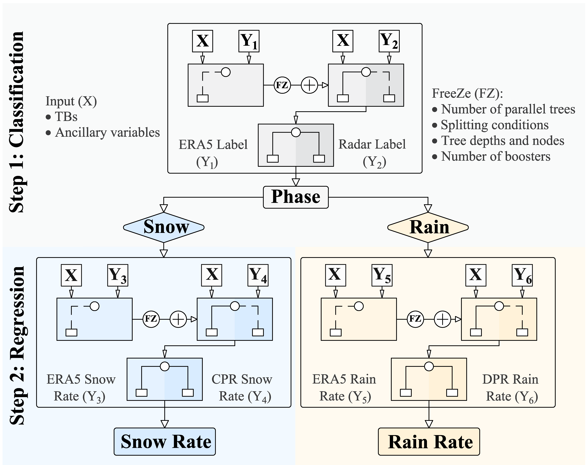
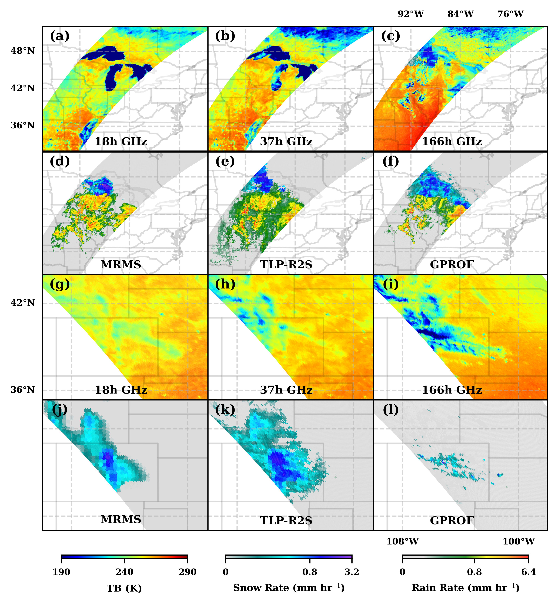

[](https://colab.research.google.com/github/Buddha-subedi/Microwave_Precipitation_Retrievals_from_TLP-R2S/blob/main/TLP-R2S_demo.ipynb)
# An Incremental Learning Framework Linking Reanalysis and Radar Data for Passive Microwave Precipitation Retrievals
This repository represents the development of an algorithm, called the Transfer Learning of global Precipitation from Reanalysis data to Satellite observations(TLP-R2S). The algorithm relies on integrating the information content from Earth System Models (ESMs)
into the retrieval process and allows the fusion of multi-satellite observations across varying spatial and temporal resolutions. It is a two-step framework: Step 1 performs classification, and Step 2 applies a regression learner depending upon the detected phase. Each step comprises two stages. In Stage I, a finite number of base trees is sequentially boosted to capture prior relationships between input variables and ERA5 precipitation phase and rate. In Stage II, with a frozen pre-trained model, additional boosting rounds are appended to learn posterior relationships between TBs and active radar observations from DPR and CPR, thereby refining phase and rate estimates.
<p align="center">
  
</p>

<p align="center"><em>The TLP-R2S architecture employs incremental training of an ensemble of gradient-boosted decision trees to transfer knowledge from ERA5 simulations to spaceborne radar observations. It is a two-step framework: Step 1 performs classification, and Step 2 applies a regression learner depending upon the detected phase. Each step comprises two stages. In Stage I, a finite number of base trees is sequentially boosted to capture prior relationships between input variables and ERA5 precipitation phase and rate. In Stage II, with a frozen pre-trained model, additional boosting rounds are appended to learn posterior relationships between TBs and active radar observations from DPR and CPR, thereby refining phase and rate estimates.</em></p>

<a name="4"></a> <br>
## Code

<a name="41"></a> <br>
###   Setup
To run this notebook on Google Colab, clone this repository
```python
!git clone https://github.com/Buddha-subedi/PMWPrecip_TLP-R2S.git
os.chdir("Microwave_Precipitation_Retrievals_from_TLP-R2S")
```


```python
import numpy as np
import pandas as pd
from sklearn.utils import shuffle
from pathlib import Path
import xgboost as xgb
import os
import scipy.io
import pmw_utils
import importlib
import matplotlib.pyplot as plt
import matplotlib.colors as mcolors
from sklearn.model_selection import train_test_split
from sklearn.metrics import accuracy_score, confusion_matrix, f1_score, mean_squared_error
import scipy.stats as stats
from scipy.interpolate import interp1d
importlib.reload(pmw_utils)
from pmw_utils import plot_confusion_matrix, TLPR2S_model
```
<a name="42"></a> <br>
 ### Load the Data
 
```python
paths_phase = {
    'cpr_train': 'data/df_cpr_phase_train.npz',
    'cpr_test':  'data/df_cpr_phase_test.npz',
    'dpr_train': 'data/df_dpr_phase_train.npz',
    'dpr_test':  'data/df_dpr_phase_test.npz',
    'era5_train': 'data/df_era5_phase_train.npz',
    'era5_test':  'data/df_era5_phase_test.npz'
}
data = {k: np.load(p) for k, p in paths_phase.items()}
dfs = {k: pd.DataFrame(dict(v)) for k, v in data.items()}
df_cpr_phase_train = dfs['cpr_train']
df_cpr_phase_test  = dfs['cpr_test']
df_dpr_phase_train = dfs['dpr_train']
df_dpr_phase_test  = dfs['dpr_test']
df_era5_phase_train = dfs['era5_train']
df_era5_phase_test  = dfs['era5_test']
```


<a name="43"></a> <br>
 ### Train the TLP-R2S Model
TLP-R2S Model has 3 base learners. The hyperparameters and snippet of code adopted for stage 1 and stage 2 for the phase detection is provided below

```python
#stage 1
classes = np.unique(df_era5_phase_train['Prcp flag'])
class_weights = {0: 1, 1: 1.15, 2: 1.32}

sample_weights_70 = df_era5_phase_train['Prcp flag'].map(lambda x: class_weights[classes.tolist().index(x)])

params = {
    'objective': 'multi:softmax',
    'num_class': 3,
    'eval_metric': 'merror',
    'reg_alpha': 1.351,
    'reg_lambda': 5.219,
    'max_depth': 14,
    'num_parallel_tree': 3,
    'learning_rate': 0.41302,
    'gamma': 0.225,
    'verbosity': 0
}

booster_era5 = xgb.train(
    params=params,
    dtrain=dtrain,
    evals=evals,
    num_boost_round=88,
    verbose_eval=True
)


#stage 2
classes = np.unique(df_phase_train['Prcp flag'])
class_weights = {0: 1, 1: 1.267, 2: 1.966}
sample_weights_sat = df_phase_train['Prcp flag'].map(lambda x: class_weights[classes.tolist().index(x)])

# Set parameters
params_1 = {
    'objective': 'multi:softmax',
    'num_class': 3,
    'eval_metric': 'merror',
    'subsample': 0.5,
    'reg_alpha': 6.948,
    'reg_lambda': 5.0278,
    'max_depth': 16,
    'num_parallel_tree': 6,
    'learning_rate': 0.011,
    'gamma': 0.32,
    'verbosity': 0
}

booster_era5 = xgb.train(
    params=params_1,
    dtrain=dtrain_era5,
    evals=evals,
    num_boost_round=83,
    verbose_eval=True
)

# Train with the new data (booster here is the final model that is first trained on coarse
# resolution information from ERA5 and then fine-tuned on fine resolution satellite information)
params_2 = {
    'objective': 'multi:softprob',
    'num_class': 3,
    'eval_metric': 'merror',
    'reg_alpha': 6.948,
    'reg_lambda': 5.0278,
    'max_depth': 15,
    'num_parallel_tree': 6,
    'learning_rate': 0.018,
    'gamma': 0.32,
    'verbosity': 0
}

booster_cpr = xgb.train(
    params_2,
    dtrain_cpr,
    num_boost_round=80,
    evals=evals,
    xgb_model=booster_era5,
    verbose_eval=True,
    feval=f1_eval_all_classes
)
```


<a name="44"></a> <br>
 ### Orbital Retrievals
```python
[phase, rain, snow, latitude, longitude] = TLPR2S_model(path_orbit_004780, booster, snow_rate_booster, rain_rate_booster, df_cdf_rain, df_cdf_snow);
```
<p align="center">
  
</p>
<p align="center">
  <em>Three selected GMI TBs (a--c) and precipitation from MRMS (d), TLP-R2S (e), and GPROF (f) for orbit 045821 on March 23, 2022, over the Midwest United States. Likewise, selected GMI TBs (g--i) and corresponding MRMS (j), TLP-R2S (k), and GPROF (l) precipitation for orbit 045212 on February 11, 2022, over Colorado and Wyoming.</em>
</p>


## Dataset
The complete dataset for training the networks and retrieving sample orbits is available here: (https://drive.google.com/drive/folders/1NwouPlF4kF2kdHWRwpCHfHnjyaW14xzP?usp=sharing).
